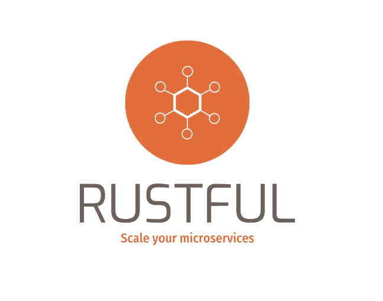

<p align="center">
  <a href="https://github.com/rustful-rs/rustful">
    
  </a>
  <br>
</p>

<p>
<b>Rustful</b> is an <a href="https://github.com/expressjs/express">Express</a> inspired <b>web framework</b> using a powerful extractor system built on top of <a href="https://tokio.rs/">Tokio, Tower, Axum, and Hyper</a>. Designed to improve, speed, and scale your microservices with a friendly syntax, Rustful is built with <a href="https://www.rust-lang.org/">Rust</a>. that means Rustful gets memory safety, reliability, concurrency, and performance for free. helping to save money on infrastructure.
</p>

## ⚡️ Quickstart

```rust
use rustful::{RustFul, http::Methods};


#[tokio::main]
async fn main() {
    let mut app = RustFul::new();

    app.get("/", || async {
        "Hello, World 👋!"
    });

    app.run("127.0.0.1:8000").await;
}
```

## JSON

```rust
use rustful::{Json, RustFul, http::Methods};
use serde_json::json;


#[tokio::main]
async fn main() {
    let mut app = RustFul::new();

    app.get("/", || async {
        Json(json!({
            "name": "full_name",
            "age": 98,
            "phones": [
                format!("+44 {}", 8)
            ]
        }))
    });

    app.run("127.0.0.1:8000").await;
}
```

## Resource

```rust
use rustful::{Json, RustFul, http::{StatusCode, resource::Resource, response::Response}, Request, IntoResponse};
use async_trait::async_trait;
use serde_json::json;


struct Article;

#[async_trait]
impl Resource for Article {

    async fn get(_req: Request) -> Response {
        let posts = json!({
            "posts": ["Article 1", "Article 2", "Article ..."]
        });
        (StatusCode::OK, Json(posts)).into_response()
    }

    async fn post(_req: Request) -> Response {
        (StatusCode::CREATED, "post handler").into_response()
    }

    // you can use put, delete, head, patch and trace
}


#[tokio::main]
async fn main() {
    let mut app = RustFul::new();

    app.resource("/article", Article);

    app.run("127.0.0.1:8000").await;

}
```

## Groups


```rust
use rustful::{
    Json,
    extract::Path,
    RustFul,
    http::{ Methods, StatusCode }
};

use serde_json::json;


async fn index() -> &'static str {
    "index handler"
}

async fn name(Path(name): Path<String>) -> impl IntoResponse {
    let user = json!({
        "response": format!("my name is {}", name)
    });
    (StatusCode::CREATED, Json(user))
}

#[tokio::main]
async fn main() {
    let mut app = RustFul::new();

    // GROUP /api
    let mut api = app.group("api");

    // GROUP /api/user
    let mut user = api.group("user");

    // GET POST PUT DELETE ... /api/user
    user.resource("/", Article)

    // GET /api/user/samuel
    user.get("/:name", name);

    // GROUP /api/post
    let mut post = api.group("post");

    // GET /api/post
    post.get("/", index);

    // GET /api/post/all
    post.get("/all", || async move {
        Json(json!({"message": "hello world!"}))
    });

    app.run("127.0.0.1:8000").await;
}
```
