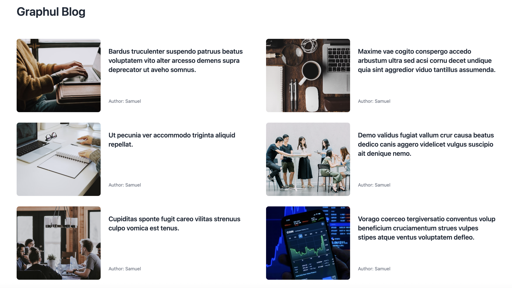
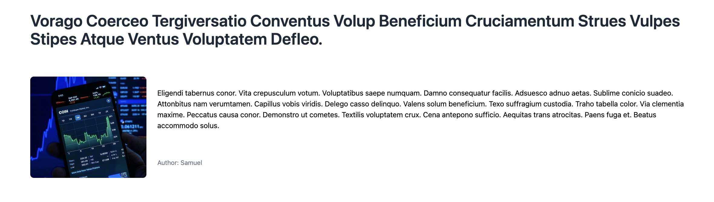

# Getting Started with Graphul and React

Graphul supports native spa routes :)

## Available Scripts

### Requirements:

* Nodejs
* Npm
* Rust :)

In the project directory, you can run:

### `bash run.sh`

Runs the graphul server.\
Open [http://127.0.0.1:8000](http://127.0.0.1:8000) to view it in your browser.

### Detail page

[http://127.0.0.1:8000/6](http://127.0.0.1:8000/6)

